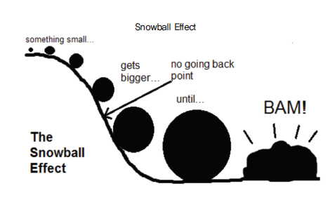
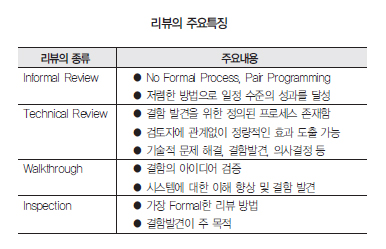
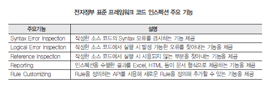
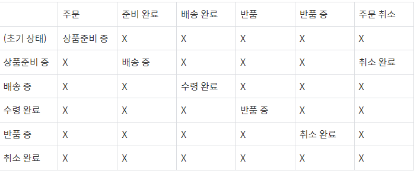
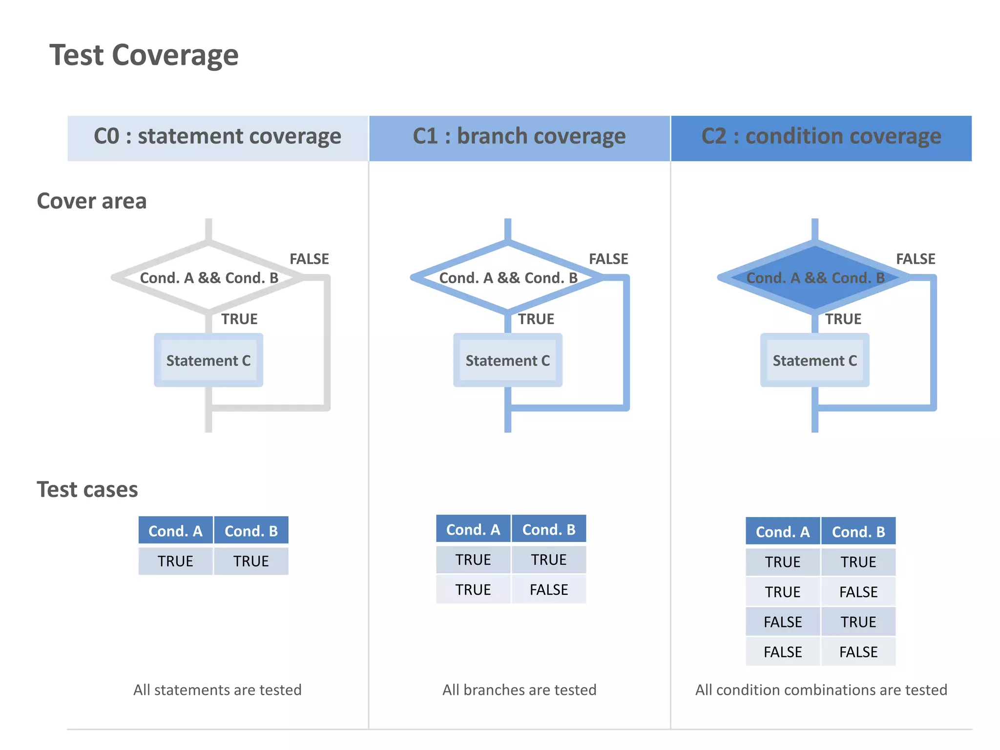
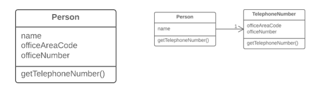

(검색이 어려워서 제가 보려고 만든 전체 요약본)

테스트 시작하기
=============

## 1.1 시프트-레프트의 개요

- 조기 품질 = 시프트-레프트
  - 전체 개발 과정에서 품질을 향상하는 활동을 조기에 설계하는 것 -> 기존에는 품질 검사를 개발/빌드가 끝나고나서 했음
  - 시프트-레프트하다 = 애자일에서의 품질 보증이 될 것, 조기 품질 향상을 목적으로 둘 것

## 1.2 애자일에서의 품질

- 그래서 스크럼이란?
  - 중첩된 개발 단계, 다중 학습, 유연한 관리 체계, 조직내 학습 공유
  - 다양한 기능을 가진 팀이 처음부터 마지막까지 함게 작업 = 그러니까 테스트 담당자도 개발자도 AtoZ 함께하는 것
  - 개발하고 -> 개발끝나면 테스트하고 이게 아니라 서로 유기적으로 행동

- 애자일한 테스트
  - 작업 지침용 상자
  - 개발자의 구체적인 작업 지침 = 지표를 어떻게 달성할지에 관한 구체적 활동, 예를 들어 개발자 테스트에서 일정 수준 이상의 코드 커버리지 비율 달성
  - 테스트 담당자의 구체적인 작업 지침 = 애자일에서는 시스템 테스트 활동 정의X니까 각 조직이 정의 해야함(이게맞나) -> 데이터 기반의 시스템 테스트를 정의해야함

시프트-레프트 테스트
=============

- 모든 단계의 버그를 시스템 테스트로 해결하지 말 것
    -> 사실 애자일에서도 마지막 테스트&유지보수 상태에서 버그를 시스템 테스트로 잡아내려하는데, 이것도 혼돈상태라고 봐야함
    - 왜냐? **제품 개발 과정에서 테스트가 제일 분주한 시점일텐데 이걸 후반부에 두어 일정에 쫓겨 릴리스 한다는 건 결국 리스크이기 때문**
    - 다른 공학 계열에서 어떻게 테스트를 하는지 대입해 생각해볼 것 -> 예를 들어 제조업에서 각 부품의 신뢰성을 확인하지도 않고 갑자기 완제품을 테스트 해보진 않듯이, 소프트웨어도 각각의 단위 테스트도 진행하지 않은 상태에서 통합 테스트를 진행하는 것은 생산적이지 못함

Q) 개인적인 의문
1. 그러면 애자일하게 일을 진행하는 팀에서는 테스트를 전부 코딩후에 하는건가?
2. 테스트코드를 작성하는 것만으로는 커버가 안되는건가? -> 개발자가 코드작성, 테스트 담당자가 테스트코드 작성등으로는 커버 불가능?

## 2.1 시프트-레프트 모델

- 그래서 조기 품질을 높이기 위한 시프트-레프트 모델이란?
  - 요구 사항 및 사용자 스토리의 명확화
  - 클래스나 함수 구조를 간단히 유지
  - 단위 및 통합 테스트 실행
  - 리뷰 실시

Q) 사용자 스토리의 명확화라는건 페르소나 얘기하는건가?


## 2.2 시프트-레프트 테스트 특징

사실상 모든 조직은 아래와 같은 딜레마를 안고 있음 

1. 경영진은 시프트-레프트로 품질 보증을 원하나 엔지니어들이 바쁘다고 회피함
2. (회피라곤 했지만..) 실제로 엔지니어들은 바쁨

**그러나 수치적으로 조기 단계에서에서 품질을 보증하는 편이 출시 후의 품질을 높이는 지름길**
결론적으로 후반 단계에서 버그를 찾아내도 출시 후의 오류를 줄이는 데는 한계가 있음. 통합 테스트에서 발견하는 버그는 많아봐야 40%이고 조기단계에서 발견할 수 있는 버그는 85%

Q) 구체적으로 조기단계에서 발견할 수 있는 버그라는게 뭐지? 설계상의 오류를 뜻하는 것같음..

조기 코드 인스펙션, 리뷰, 반복 개발, 주기적 구축 등에 중점을 두면 결함 추출 곡선은 개발 초기 단계로 이동함



그래서 코드리뷰나 인스펙션을 충분히 실시해서 통합 테스트나 시스템 테스트에서 발견되지 않도록 해야함!

- 프로젝트 후반에 버그를 없애는 비용은 전반에 드는 비용의 수 배에 달함 -> 효율 낮음 = 비용 발생
- 프로젝트 후반에 버그를 없애려고하면 해결되지 않은 버그가 출시 후에 남겨질 리스크 또한 존재

전문적으로 얘기하자면 개발 단계가 뒤로 갈수록 버그 수정에 드는 공수가 기하급수적으로 올라감 (요구사항에서 1의 난이도라면 출시후엔 100의 난이도인셈)

PS) 그런데 코드 인스펙션이 뭐야? (참조 : https://dataonair.or.kr/db-tech-reference/d-lounge/expert-column/?mod=document&uid=54455)





코드 인스펙션 = 코드 정적 분석, 그러니까 실행해서 코드가 잘 돌아가는지 확인하는게 아니라 구문 오류가 있는지 논리적으로 맞는지 툴을 이용해 분석하는 것 -> 그냥 별거 아니고 우리가 아는 ESLint, IntelliJ Inspection 이런거임

PS) 이터레이션이란? 이터레이션은 개발 과정을 나타내는 데 사용되는 용어로, 특히 애자일 개발 방법론에서 각 개발 사이클 또는 단계를 의미 (고마워 따봉 GPT야!)


개발자 테스트의 기본 중 기본
=============

### **적어도 클래스 다이어그램과 시퀀스 다이어그램만은 작성하라!** 
->  왜냐?클래스 다이어그램이 있으면 큰 클래스를 방지할 수 있고 리팩터링의 효과도 시각화 할 수 있음

## 3.1 개발자가 반드시 알아야 할 테스트 기법

### 소프트웨어 개발 시 수행하는 테스트 목록

- 단위 테스트
- 조합 테스트
- 경곗값 테스트
- 상태 전이 테스트
- 탐색적 테스트
- 통합 테스트
- 시스템 테스트

모든 테스트를 수행할 수 없으므로
테스트 **라이프 사이클(단위 -> 통합 -> 시스템)** 의 각 단계에 맞춰 적절한 **테스트 방법(경곗값/조합/상태 전이)** 를 수행해야함

### 단위 테스트에서 이해해야할 3가지 기법

1. **경곗값 테스트 : 문자 그대로 경계를 테스트하는 방법**

    예를 들어
    어떤 시스템이나 애플리케이션이 나이를 입력 받아, 나이가 18세 이상 65세 이하인 경우만 "적합"으로 판단하는 기능을 가지고 있다고 할때  
    
    이 경우의 경계값은 18세와 65세. 그러므로 경계값 테스트에서는 이 경계값들 주변의 값을 사용하여 테스트 케이스를 만듬. 일반적으로 다음과 같은 값들을 테스트에 포함

    - 경계값 바로 아래의 값: 17세  
    - 경계값 자체: 18세, 65세  
    - 경계값 바로 위의 값: 66세

    이 경우 발생하는 버그 네가지

    - 올바른 코드
    ```
    if(a>=18 && b<=65){
        // 출력
    }else {
        // 에러 처리
    }
    ```

    - 닫힘 관계 버그 : >= 로 입력해야하는데 >라고 잘못 입력한 경우
    ```
    if(a>18 && b<65){
        // 출력
    }else {
        // 에러 처리
    }
    ```

    - 잘못 입력한 숫자, 요구사항 사양 오해 : 수 자체를 잘못 입력
    ```
    if(a>19 && b<64){
        // 출력
    }else {
        // 에러 처리
    }
    ```

    - 경계가 없음 : 조건문 작성하는 것을 잊은 경우
    ```
    if(a>=18 && b<=65){
        // 출력
    } // 이외의 예외를 처리하지 않음
    ```

    - 여분의 경계 : 불필요한 경계를 개발자가 작성함
    ```
    if(a>=18 && b<=65 && b>100){
        // 출력
    }else {
        // 에러 처리
    }
    ```
  
2. **상태 전이 테스트**

    '상태'를 모델화해서 테스트를 수행하는 방법. 크게 **상태**와 **전이**로 나뉨

    예시 (출처 : https://story.pxd.co.kr/1549)

    **애플리케이션 상태**  
    

    **상태 전이 매트릭스**  
    

    상태 전이 매트릭스에서 설계상 그런 이벤트가 발생하지 않을때 NA로 표시하는 것
    예를 들어 여기선 배송 중일때 반품을 할 수 없는데 반품할 수 있게된다면 버그인 셈

    상태 전이 테스트에서는 클래스나 함수 레벨에서 단위 테스트를 끝내고 해당 클래스가 인스턴스가 되어 다른 함수나 인스턴스가 호출되는지를 확인 = 시스템 전체에 대한 테스트 인 셈, 조기 단계의 테스트보다는 후반 테스트의 범주에 포함되는 경우가 많음

    개발자라면 상태 전이에 관한 에러 처리나 예외 처리를 고려해야함, 또한 어떤 상태에서 다음 상태로 전이할 수 없는지 어떤 파라미터가 필요한지 에러 메세지를 표시할지에 대해 테스트 담당자에게 전달해야함


코드 기반 단위 테스트
=============

단위테스트 = 광범위하게 사용됨. 코드의 정확성을 확인하는 테스트인지 단위 기능에 관한 테스트인지를 명확하게 할 것


## 4.1 코드 기반 단위 테스트

- 함수의 커버리지 비율을 측정해 로직의 확실성을 확인하는 화이트박스 테스트 = 코드 기반 단위 테스트

*화이트박스 테스트 = 모듈의 원시 코드를 오픈시킨 상태에서 원시 코드의 논리적인 모든 경로를 테스트하여 테스트 케이스를 설계하는 방법


다음과 같은 항목 확인

- 프로그램을 실행하는 도중 시스템상의 이상 작동을 수행하지 않음(null pointer, 0으로 나누는 계산)
- 입력값과 그에 대응하는 기댓값을 출력
- 모든 분기가 올바르게 처리됨(경곗값 테스트)

## 4.2 명령 커버리지(C2)

**C0커버리지**라고도 부름

간단하게 설명하자면 테스트 기준(테스트에서 적어도 한번은 모든 명령문을 실행)을 세우고 모든 조건분기를 타도록함 = 그러나 이 경우 테스트할 수 없는 경로가 발생하기도함

-> 불완전한 테스트, 그래서 **조건 커버리지**를 같이 수행해야함


## 4.3 조건 커버리지(C1)

**C1 커버리지**, C0 커버리지의 문제를 해결하는 기법 = 대부분의 경우 이 커버리지 방법으로 수행하는 것이 좋음

간단하게 설명하자면 각각의 판정조건이 TRUE,FALSE인 결과를 적어도 1번씩 가지는 테스트 케이스를 작성하는 것

### 참고 예시




## 4.4 자주 발생하는 단위 테스트 오류

이전까지만보면 조건 커버리지면 만사 OK 같지만,
**함수의 in/out을 체크하고 함수가 그 책임과 의무를 달성하는지도 동시에 주의해야함**

그래서 입력값의 패턴을 100% 커버하고, 그에 대한 기대 처리가 올바른지를 체크하는 것이 효과적인 단위테스트


## 4.5 코드 기반 단위 테스트 작성법

### 테스트 주도 개발 (TDD) = 애자일 개발과 상성이 좋음!
- 실제 소스 코드를 작성하기 전에 테스트 케이스를 작성
- 모든 테스트 코드를 자동화
- 버그는 즉시 수정
- 전문 테스트 담당자를 투입

### 일반적인 테스트 방법

테스트 코드를 먼저 작성한 뒤 실제 함수 처리를 작성

**TDD의 단계**
1. 레드: 항상 실패하는 테스트를 작성(간단하게 메서드의 형태만 작성해두고)
2. 그린: 테스트를 통과할 정도의 최소한의 프로덕션 코드를 작성(올바르게 로직을 작성하고)
3. 리팩터: 테스트가 통과하면 프로덕션 코드를 리팩토링(개선을 한다)

PS) 레드 -> 그린 -> 리팩터 순으로 짜고 커밋할 것


## 4.6 커버리지 비율: 코드 기반 단위 테스트의 성패를 측정

자동차같은 미션 크리티컬 소프트웨어라면 100퍼의 커버리지가 필요하지만, 그 외의 소프트웨어라면 80퍼도 충분!(사실 어디서도 커버리지 비율의 적절한 목표에 대해서 정해놓지않음. 논문이든 ISO나 IEEE규격이든)

그러면 왜 80%가 충분하냐? 소스 코드의 20% 정도는 에러 핸들링 처리인 만큼 그 코드까지 단위테스트로 커버할 필요는 없기때문

구글 코드 커버리지와 관련한 내부 가이드 라인
- 60% : 허용 범위
- 75% : 권장
- 90% : 모범적

단위 테스트 효율화 : 쉬운 단위테스트
=============

커버리지 비율은 80:20(파레토 법칙)의 두 부분만 측정할 수 있다면 충분

+) 파레토 법칙이란 80:20 법칙이라고도 불리는데, 80%의 결과가 20%의 원인에 의해 발생한다는 것

## 5.1 코드 복잡도

### 소스 코드 복잡도란?

- 복잡도가 높음 = if 또는 switch 문이 많음
- 복잡도가 낮음 = if 또는 switch 문이 적음

복잡도가 높을수록 유지보수성은 낮아지고, 복잡도가 낮을수록 유지보수성 높아짐

**C(복잡도) = e(프로그램에 포함된 경로 수) - n(프로그램에 포함된 분기점 수) + 2**

이러한 예제코드가 있을때

```
let x = 1;  
while (x < 10) {  
  if (x % 2 === 0) {  
    console.log('x는 지금 짝수입니다!')  
  } else {  
    console.log('x는 지금 홀수입니다!')  
  }  
  x++;  
}

```


(출처 : https://velog.io/@bdbest72/%EC%BD%94%EB%93%9C-%EB%B3%B5%EC%9E%A1%EB%8F%84%EB%A5%BC-%EC%B8%A1%EC%A0%95%ED%95%98%EB%8A%94-%EB%B0%A9%EB%B2%95)


이때 경로수(8) - 노드 갯수(7) + 2 이므로 복잡도는 3인셈

## 5.2 단위 테스트의 대상

버그를 완전히 없애는건 불가능! 소프트웨어는 여전히 중간에 동작이 중단되는 행업 현상을 겪음 -> 그런데 사실 소프트웨어가 사용자가 바라는 기능을 충분히 제공한다면 상관없음, 크게 중요하지도 않은 세세한 테스트를 하며 힘을 빼지 말것

개선이란 현재의 업무를 효율적으로 수행, 그리고 동시에 품질을 높이는 것임

그러면 어떻게?

### 단위 테스트할 범위를 선정

80:20 -> 소프트웨어의 20%부분에서 80%의 버그가 나옴(막연하게 생각하자면..)
최근 발표된 논문을 참고하자면 
**대부분의 버그는 소스 코드 파일의 약 10~20%의 변경횟수가 많은 파일에서 발생함**

그렇다면? 코드의 20%를 커버하면서 탐색적 테스트를 수행하면 테스트는 완료! 
그런데 그 20%를 어떻게 추출? -> 최근 변경 횟수에 가중치를 붙이고 과거에 변경된 파일은 가중치를 붙이지 않음

**핫스팟 사고방식**
핫스팟 = 버그가 발생하기 쉬운 정도를 수치화한 것
핫스팟 값이 큰 파일에서 버그가 발생한다고 봐도 됨. 계산은 아래와 같이 (식 첨부 안했는데..
무언가의 계산에 따라 값을 구하고, 그 값이 크면 소스 코드를 확인한다 정도로 생각하기)

### 독자적인 방법: 파일을 2개로 분리
고전적 방법에서는 파일 변경 횟수만 고려하지만, 필자는 단위 테스트 수행 우선순위 지표로 파일 행 수의 길이를 추가함. 파일의 최근 변경 횟수가 많고 행 수가 긴것 부터 단위 테스트를 수행(가중치를 추가하는 셈)

복잡도와 핫스팟 값을 구해 어디부터 수정해야할 지 확인할 것
예를 들어 환경 정의 파일일때는 복잡도가 높으나 핫스팟이 작을 수 있고
간단한 구조임에도 변경 횟수가 많은 경우도 있음

복잡도가 높고 핫스팟 값이 높다 = 리팩토링
복잡도 낮은데 핫스팟 값이 낮다 = 코드 재확인

리팩토링할 시간이 없다면요? -> 먼저 파일을 2개로 분리(진짜. 물리적으로. 코드를 뜯으란얘기)

코드가 긴 파일은 규모가 큰 클래스 이거나 깔끔한 구조를 만들지 못해 함수들의 쓰레기통(ㅋㅋ)이 된 경우가 많음 이걸 물리적으로 구분해놓으면 결국 정리하게 됨


PS)

- 블랙박스 테스트 : 요구사항에 사양에 따라 정의된 입력값과 출력값을 사용해 시스템 또는 컴포넌트가 사양대로 작동하는지 확인하는 테스트
- 화이트박스 테스트: 요구사항 사양에 따라 정의된 입력값과 출력값을 사용해 시스템 또는 컴포넌트가 사양대로 작동하는지를 코드 커벌히지를 통해 확인하는 테스트.

-> 본질적으로 블랙박스 테스트와 화이트박스 테스트는 같음(왜 같다고보지? 보통은 다른딩)

- 커버리지 비율 달성 : 커버리지 비율은 테스트가 소프트웨어 코드의 얼마나 많은 부분을 실행(또는 '커버')했는지를 수치적으로 나타내는 지표입니다. 
- 기댓값 체크 : 기댓값 체크는 테스트 케이스를 실행했을 때, 소프트웨어가 예상되는 특정 결과 또는 값을 반환하는지를 확인하는 과정
  -  입력 값: 테스트 실행에 사용되는 데이터입니다.
  -  기대 결과 (기댓값): 주어진 입력에 대해 시스템이 반환해야 하는 예상 출력 값입니다.
  

따라서, 커버리지 비율은 테스트가 소프트웨어 코드의 어느 부분을 검증했는지에 대한 양적 평가를 제공하는 반면, 기댓값 체크는 테스트의 질적 측면, 즉 소프트웨어가 올바른 결과를 반환하는지를 평가합니다. 두 개념은 서로 보완적이며, 소프트웨어 개발 과정에서 모두 중요한 역할을 합니다.


기능별 단위 테스트
=============

코드 기반의 단위 테스트말고 UI에서 기능(복잡한 기능)단위로 단위 테스트를 수행하고 싶은 경우

## 6.1 개발자가 확인할 단위 기능 테스트

기능 단위의 테스트 = 블랙박스 테스트

### 정렬 기능의 단위 테스트

정렬 기능을 생각한다고하면 하나하나 정렬하는 걸 생각해야할텐데
기능 단위의 단위 테스트 방법의 기본 요소를 고려해야함
- 단위 기능 경곗값
- 조합

**단위 기능 경곗값**
나이를 기준으로할 때
- 0세일때 프로그램이 에러 없이 처리할 수 있는가
- 그 경계에 있는 -1를 에러로 처리할 수 있는가
- 그리고 상한의 값은 몇인가
- 만약 나이에 알파벳이 포함되어 있다면 어떻게 될지?

또 다른 경곗값의 예로는
- 데이터의 건수가 0일때
- 데이터의 건수가 1일때
- 데이터의 건수가 매우 많을때

**조합**
일반적으로 조합할 때는 반드시 해당 조합에서 버그가 발생하기 쉬운가를 생각해야함 -> 데이터의 건수가 1인 경우를 확인했다면 2개의 요소를 조합해 기능이 제대로 동작하는지?

예를 들어 같은 나이일때는 그다음 기준인 입사 연도순으로 정렬, 입사 연도가 같을 때에는 순위대로 등 -> 먼저 데이터가 1과 2일때 확실하게 커버하고 n이라는 테스트 케이스를 적절한 개수로 한정해 작성할 수 있어야함

**단위 기능이 복잡한 경우는 자동화 테스트를 권장한다!**


리팩터링
=============

리팩터링의 목적이 무엇일까? 코드의 가독성을 높이기? 아니면 유지보수성을 높이기?
조기/애자일 품질을 보증하기 위해 리팩터링이 필요하다!
- 코드에 관한 본질론에서 리팩터링을 권장
- 익스트림 프로그래밍의 실천 방안으로서의 리팩터링 = 정확히는 코드구조를 바꾸는게 아니라 코드 작성의 흐름을 정비하기 위함임

+) 익스트림 프로그래밍 = 소프트웨어 개발 프로세스 중 하나로, 빠르고 반응성 높은 개발 사이클을 강조하는 애자일 개발 방법론(짧은 릴리즈 사이클과 페어 프로그래밍등이 특징)

이번에는 **코드 품질의 본질론**에서 리팩터링에 관해 생각해보자!

## 7.1 단위 테스트가 어려운 복잡한 코드

코드가 일정 수준 이상 복잡할때 단위테스트를 작성하기보단 다음의 리팩터링을 시도해보자!

1. 파일의 전체복잡도가 높다면 먼저 파일을 2~3개로 분리한다.
2. 그래도 복잡도가 내려가지 않는다면 기존의 복잡한 함수 코드에 대한 단위 테스트를 작성한다.
3. 목(mock)을 작성한다.
4. 커버리지 비율을 측정하고 커버리지 비율이 75%가 될 때 까지 단위 테스트를 추가한다.
5. 리팩터링한다.
6. 단위테스트를 실행하고 결과가 같은지를 확인한다.

Q) 그런데 해당 서비스코드를 참조하고있는 다른 메서드들이 많다면 이렇게 함부러 리팩토링해도되는건가?(로직을 분리해도..?)

이와 같은 사항에 주목
- 복잡도 낮추기
- 출구를 하나로 통합
- MVC를 분리
- 파일 코드의 단축

## 7.2 파일 코드 리팩터링

사실 파일의 코드가 길어지는 이유는 책임과 의무가 적절하게 구분되지 않았기 때문! (클린코드하셔라~)

안티패턴
- 어떤 파일에도 포함되기 애매하니 어딘가에 대충 넣어두는 경우
- 매우 많은 중복 코드
- 규모가 큰 클래스에 의한 파일의 비대화

PS) C언어에서 함수를 사용하면 프로그램의 실행 속도가 느려지므로 중복코드가 정당화되었던경우도 있으나 이제는 멀티코어 환경이 당연한 시대다보니 이건 핑계임!

## 7.3 큰 클래스의 리팩터링

큰 클래스의 리팩터링 또한 파일 코드를 짧게 만드는 리팩터링 방법임!

### CK 지표
ck 지표는 하나의 지표가 아닌 몇가지 지표의 집합임 -> 간단히 말하면 클래스 구조가 복잡하다거나 1개의 클래스에 지나치게 많은 멤버를 넣으면 버그가 발생한다와 같은 지표

WMC = 클래스당 평균 메서드수 -> 평균 WMC는 프로그램의 모든 메서드를 세고, 그것을 모든 클래스 수로 나누면 됨

결론만 말하자면 클래스당 메서드 수는 10개를 안넘는게 좋음

CK 지표 그룹에는 WMC외에도 DIT(평균 클래스 상속 깊이)또는 NOC(평균 자식 클래스 수)등이 있음
CK 지표의 값이 클때에는 반드시 리팩터링! 마틴 파울러가 제안한 클래스 추출이라는 방법 활용해볼것!

### 큰 클래스를 쪼개는 방식



(출처 : http://dj6316.torchpad.com/%EB%A6%AC%ED%8C%A9%ED%86%A0%EB%A7%81%28refactoring%29/CH.07+%EA%B0%9D%EC%B2%B4++%EA%B0%84%EC%9D%98+%EA%B8%B0%EB%8A%A5++%EC%9D%B4%EB%8F%99/18.%ED%81%B4%EB%9E%98%EC%8A%A4+%EC%B6%94%EC%B6%9C+Extract+Class)

클래스를 분리했을때의 장점? 단위 테스트를 더 쉽게 작성할 수 있음, 핫스팟 값도 줄어듬!(잘 진행하면 핫스팟 기반의 단위테스트 대상 파일의 갯수 자체가 줄어들기도)


## 7.4 복잡도를 낮추는 리팩터링

복잡도란? 프로그램의 제어 흐름을 유효 그래프로 표현하고 그 그래프가 가진 특성에 기반해 프로그램의 복잡성을 나타내는 방법

- 높은 복잡도 = 버그가 발생하는 좋지 않은 함수

복잡도가 높은 부분을 수정하면 실패할 확률이 높으므로 프로젝트 후반 단계에서의 버그 수정은 하지 않는게 좋음.. 다만 초반 또는 중간 단계에서의 버그 수정은 적극적으로해야함.

## 7.5 출구는 하나

가장 중요한 코딩 표준 = 함수의 출구를 한군데 또는 두군데로 만드는 것. 출구가 두군데일 경우 반드시 입구에서 파라미터에 대한 에러 체크만하며 절대로 함수안에서 return하지 않아야함

무슨얘기일까? 함수의 출구를 한군데 또는 두군데로 만든다는 말은, 함수 내에서 데이터의 흐름을 단순화시켜, 함수가 반환(return)을 수행하는 위치를 제한하는 코딩 원칙을 의미함

**단일 출구 원칙** : 함수는 단 한군데서만 종료 되어야함, 함수의 흐름을 추적하기 쉽고 함수 종료 시 필요한 정리 작업이나 추가적인 처리를 한곳에서만 관리할 수 있게 해줌. 

예를 들어 함수 마지막 부분에서만 결과값을 반환하고 그 이전의 모든 조건분기는 결과값을 변수에 저장만하고 실제 반환은 함수의 맨 마지막에서 실행!

**이중 출구 원칙** : 일부 경우에는 함수 시작 부분에서 입력 파라미터에 대한 검증이나 에러 체크를 수행하고 잘못된 입력에 대해 즉시 반환하는 것이 효과적. 이런 경우엔 함수에 두군데의 출구가 있게됨. 하나는 입력 검증 후 초기 에러 처리용 다른 하나는 정상적인 종료 지점

예를 들어 이런거임

```
public int divide(int numerator, int denominator) {
    if (denominator == 0) {
        return -1; // Early exit on error condition
    }

    int result = numerator / denominator;
    return result; // Normal exit point
}

```

여기선 입력값에 대한 오류가 있다면 해당 오류에 대한 출구 하나. 정상적인 상황에서의 출구 하나만 있음 = 이중 출구

여기에 대한 필자의 조언은 단순한 계산이나 데이터베이스의 저장을 함수의 최하층에서 수행하고 저장이나 반환값만 체크하는 단위 테스트가 유지보수하기 쉽다고함

## 7.6 MVC 분리

모델-뷰-컨트롤러
MVC 아키텍처를 보증해야함! (뭐 대충 중요한 이유는 많이 적어놓긴했는데 생략)

간단히 설명하자면  
**Model**      : 백그라운드에서 동작하며, 사용자가 원하는 데이터나 정보를 제공한다.

**View**        : 사용자의 요청을 화면으로 출력한다.

**Controller** : 사용자의 요청을 처리하고, 그 요청에 따른 전체적인 흐름을 제어한다.

여기서 중요한건 View에는 자바스크립트등 계산 프로그램을 포함하지 말것. 

왜 뷰를 분리해야할까? 뷰 테스트는 단위 테스트화가 어렵고 비용이 드는 시스템 테스트가 됨. 뷰 테스트에는 시간도 걸리고 UI 변경은 얼마든지 발생하기 때문

코드 리뷰
=============

## 8.1 코드 리뷰란

코드 리뷰란 다른 사람이 작성한 코드를 지적하는 것이 아니라 본인이 깨닫는 것에 중점을 둘 것! 
지적보다는 여기는 왜 이렇게 작성되어 있나요?라고 질문하는 형식을 갖춤으로써 본인이 학습하는 것

사실 리뷰가 테스트보다 더 효율적인 버그 발견 방법 -> 효율적으로 운영하려면 코드 리뷰 전에 기계가 검출할 수 있는 버그는 걸러내고, 사람은 정말 최소한의 작업만 하는 구조로 만드는 것

일반적으론
- 풀리퀘스트 -> 리뷰 -> 병합을 하는데
- 풀리퀘스트 -> 단위테스트실행 -> 실행결과를(코드와 함께) 리뷰 -> 병합

단위 테스트가 실패하는 상태에서 리뷰를 진행해도 의미가 없으니 실행하고 리뷰해!

## 8.2 페어 프로그래밍

페어 프로그래밍을하면 서로 피드백도 해주고 좋은거 알겠어 그런데 사이가 안좋은 동료와 페어프로그래밍은 끔찍할 것 같은데..

그렇다면 다음 조건을 써보세욤~

- 코딩 규약이 있으므로 불필요한 논의가 사라짐
- 모든 사람이 재충전도히어 있고 휴식 시간이 충분하므로 뷸필요한 논의X
- 페어로 함께 테스트를 작성하고 구현에 들어가기 전에 서로 이해한 내용을 조율할 기회
- 페어는 네이밍이나 기본 설계를 결정하는 메타포를 가짐
- 페어는 단순한 설계 수행, 현재의 진행 상황을 이해

그런데 시간이 없잖아요 그러면..

개발자 레벨이 낮다면 페어프로그래밍을 해보고, 높다면 페어 프로그래밍 하지말것. 중급이라면 간단한건 혼자서, 어려운건 함께


통합 테스트
=============

## 9.1 통합 테스트 패턴

큰 통합테스트에서의 활동을 설정, 단위 테스트나 시스템 테스트를 생략하는 통합 테스트 중시 방법도 있음 

API 테스트(통합 테스트)

- 목(Mock): 행동을 시뮬레이션하고, 그 상호작용을 검증하기 위해 사용되는 객체
- 스텁(Stub): 테스트 중인 코드의 외부 의존성을 대체하여 간단하게 고정된 데이터를 반환하는 객체
- 드라이버(Driver): 테스트 대상 코드 또는 모듈을 활성화시켜 실행하는데 사용되는 테스트 코드

PS) API 테스트와 단위 테스트의 차이?

- 단위 테스트
  - 단위 테스트는 가장 낮은 수준의 테스트로, 소프트웨어의 개별 구성 요소나 모듈을 대상으로 수행됩니다. 주 목적은 각 기능(함수, 메소드)이 의도된 대로 동작하는지 확인하는 것입니다.
  - 목적: 코드의 특정 세그먼트가 독립적으로 정확하게 동작하는지 검증합니다.
  범위: 가장 작은 코드 단위(함수나 메소드)를 대상으로 하며, 종종 모의 객체(Mock Objects)나 스텁(Stubs)을 사용하여 외부 종속성을 제거합니다.
  - 도구: JUnit, NUnit, pytest 등
  - 개발자 주도: 주로 개발자에 의해 작성되며, TDD(테스트 주도 개발) 접근 방식에서 중요한 부분입니다.

- API 테스트(통합테스트)
  - API 테스트는 애플리케이션 프로그래밍 인터페이스(API)가 예상대로 작동하는지 확인하는 테스트입니다. 이는 API의 안정성, 성능, 보안 및 기능을 검증합니다.
  - 목적: 외부 시스템과의 통신 인터페이스인 API가 요구 사항을 충족하는지 확인합니다.
  - 범위: 단일 API 호출뿐만 아니라 여러 API의 상호 작용을 포함할 수 있습니다. 이는 시스템 통합의 일부로 볼 수 있습니다.
  - 도구: Postman, Swagger, SoapUI 등
  - QA 엔지니어 주도: 주로 품질 보증(QA) 팀이나 개발자에 의해 수행되며, 종종 자동화되어 반복적인 테스트를 수행합니다.

## 9.2 테스트와 API 버그 밀도에 관한 사고방식

통합 테스트(API 테스트)를 수행할 때는 어떤 방법으로 하면 좋을지, 어디까지 해야 완벽할지 의문이 들 수 있음

추천 방식 : API에 입력 파라미터가 있을 때는 그 파라미터에 대한 경곗값 테스트를 하고 가능한 한 해당 API를 다양한 형태로 호출한 뒤, 상태 전이까지 커버할 수 있다면 완벽.

-> 이때 코드 커버리지 비율을 추가하지 않는 대신, 경계를 어느정도 커버했는지를 측정할 것

시스템 테스트에선 **조합 테스트**를 하지 말것, API 테스트라면 조합 테스트를 하는게 좋음


## 9.3 카오스 엔지니어링

카오스 엔지니어링 = 시스템의 프로세스,CPU 등등 무작위로 멈췄을때 시스템 전체가 치명적인 상태에 빠지지 않도록 시스템을 설계하는 도구 -> AWS에서 야무지게 지원함

비기능 테스트임 예를 들어 CPU에 부하를 주거나, 네트워크 속도를 저하하거나 -> 시프트-레프트나 애자일 테스트와는 관계X지만 대규모 시스템에는 필요한 테스트 기법임

그래서 추천 방식

단위테스트는 화이트박스 테스트로하고 통합/시스템 테스트는 블랙박스 테스트를 하기

구체적으로 어떻게? 하나 또는 두개의 블랙박스 테스트 기법을 선택, 최후 공정 테스트에서 수행 -> 이때 추천하는 것이 카오스 엔지니어링

PS)
통합테스트 = 다양한 코드 유닛이 함께 작동할때의 상호작용을 검증, 인터페이스 테스트
시스템 테스트 = 전체 소프트웨어 시스템이 대상

요즘 MSA가 유행중임 그렇다면 더더욱 마이크로 서비스 중 하나를 일부러 다운시켜보는건어떨까?

실제로 규모가 작은팀일수록 조기 버그 검출률이 높다고함! 작은 팀 안에서 모든 것을 자발적으로 개발하는 것이 애자일의 본질 중 하나임 각 마이크로 서비스의 품질을 해당 팀이 보증하고, 때로는 팀 사이의 커뮤니케이션 오류로 버그가 발생하나 -> 이를 카오스 엔지니어링으로 담보해봅시당

카오스 멍키 테스트 : 카오스 멍키(Chaos Monkey) 테스트는 Netflix에서 개발한 카오스 엔지니어링의 일부로, 무작위적으로 서버나 애플리케이션의 인스턴스를 종료시키는 방식으로 운영 환경의 견고함을 테스트하는 방법입니다. 이 툴은 주로 클라우드 기반 인프라에서 사용되며, 시스템이 예기치 않은 문제에 얼마나 잘 대응할 수 있는지를 평가하기 위해 설계되었습니다.

