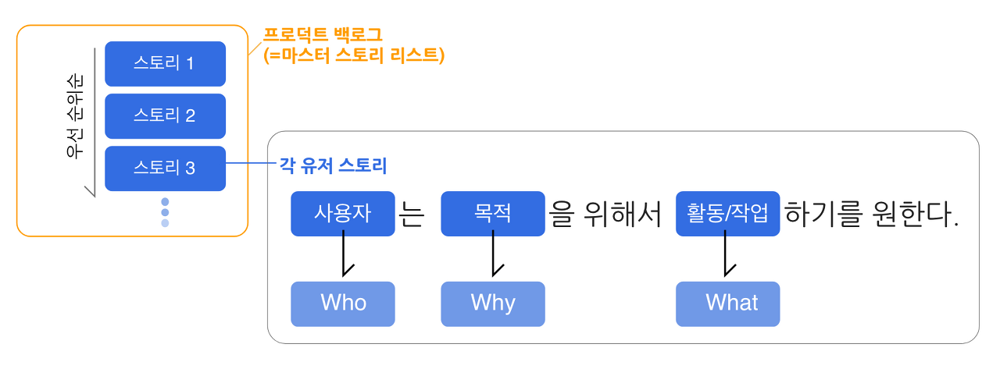

돌연변이 테스트
=============

시프트 레프트에서는 코딩과 동시에 품질 보증이 시작되기에 이제까지 사용했던 지표는 도움이 되지 않음
애자일에서의 품질보증은 데이터, 지표로 판단해야함

- 개발자의 품질 프레임워크 -> 개발자의 구체적인 작업 지침
- 테스트 담당자의 품질 프레임워크 -> 마찬가지로 구체적인 작업 지침

결과적으로 어떤 품질을 달성하고 싶은지, 어떤 정량적인 품질 목표를 세울 것인지? 어떤 테스트를 달성할 것인지가 애자일에서의 대표적인 품질 보증

그래서 추천하는 애자일에서의 적합한 대표적인 품질 지표

- 코드 커버리지 비율 (C1 기준)
- 돌연변이 테스트
- CK 지표
- 핫스팟
- 신뢰도 성장 곡선


## 13.1 돌연변이 테스트

단위테스트의 정확성을 측정하는 기법으로서 돌연변이 테스트를 사용하는 경우가 있음

### 돌연변이 테스트의 사고방식

1. 먼저 단위 테스트 케이스를 준비해야함
2. 돌연변이 테스트를 하기 전에 모든 단위 테스트가 통과하는지를 확인
3. 이후 돌연변이 테스트 도구를 사용해서 버그를 산입

-> (**문제가 있는 경우**) 버그를 강제 삽입했으므로 단위 테스트 케이스 그룹 일부에서 버그가 보고됨  
-> (**문제가 없는 경우**) 어떠한 버그도 발생하지 않음, 
    단위 테스트 케이스가 커버해야할 코드를 커버하지 않았거나 커버하고 있지만 기댓값 체크를 하지 않는 셈임 = 단위 테스트를 개선해야함

### 변이의 내용

```
if(a&b){
    c = 1;
}else{
    c = 0;
}

```

이러한 코드가 있다고 할 때 단위 테스트를 모두 실행하면 성공함  
그런데 이게 단순히 기댓값 체크를 안해서 성공한걸수도 있음!

```
if(a||b){
    c = 1;
}else{
    c = 0;
}

```

이렇게 바꿔도 기댓값 체크에서 오류가 없다면 단위 테스트가 잘못됐음을 알 수 있음

그래서 Pitest등의 도구를 도입할 수 있음

테스트 결과 상세 보고서 'Active mutators'


(적용방법 : https://gradle-pitest-plugin.solidsoft.info/)

해당 돌연변이 테스트 도구에서는

1. CONDITIONALS_BOUNDARY – replaces the relational operators <, <=, >, >=
2. EMPTY_RETURNS – replaces return values with an ‘empty’ value for that type (e.g. empty strings, empty Optionals, zero for integers)
3. FALSE_RETURNS – replaces primitive and boxed boolean return values with false
4. TRUE_RETURNS – replaces primitive and boxed boolean return values with true
5. NULL_RETURNS – replaces return values with null (unless annotated with NotNull or mutable by EMPTY_RETURNS)
6. INCREMENTS – replaces increments (++) with decrements (--) and vice versa
7. INVERT_NEGS – inverts negation of integer and floating point numbers (e.g. -1 to 1)
8. MATH – replaces binary arithmetic operations with another operation (e.g. + to -)
9. NEGATE_CONDITIONALS – negates conditionals (e.g. == to !=)
10. PRIMITIVE_RETURNS – replaces primitive return values with 0 (unless they already return zero)
11. VOID_METHOD_CALS – removes method calls to void methods

이러한 테스트등을 지원한다고 함

코드상에서 어떠한 부분이 어떤 테스트를 통과하지 못하는지 알려주는 도구이기때문에
코드리뷰에서 활용하면 좋을듯

### 돌연변이 커버리지 비율

커버리지 비율 = (테스트된 변이 수) / (생성된 변이의 총수)

a+b라는 연산이 있을때 +를 - , * , / 등등으로 수없이 바꿀 수 있음
그래서 연산 기반의 돌연변이 생성은 어느정도 필터링한 형태로 수행해야함

## 13.2 사용자 스토리와 신뢰성 지표

운영 프로파일 = 시스템의 어떤 상태로부터 다음 상태로 전이시키는 동작
사용자 스토리 기반 상태 전이 테스트란? 유저 스토리를 짜고 유저스토리1 -> 2 -> 3 이걸 오랫동안 반복해 실행하며 버그가 얼마나 검출되는지를 확인해 소프트웨어의 신뢰성을 수치로 판단하는것

**유저 스토리란?** 고객이 자신의 소프트웨어에 원하는 기능을 짧게 표현한 것으로, 프로덕트 백로그 관리에 사용된다.

(참조 : https://brunch.co.kr/@famelee/32)

## 13.3 신뢰도 성장 곡선 지표

사용자 스토리 기반의 테스트는 어떻게 지표화할까?

우선 신뢰성이란 뭘까(아니 저자 진심 설명 이상하게 하네) -> 신뢰성이란 같은 결과를 낳는다는 뜻, 책 안에서는 평균 고장 발생 간격 즉, 소프트웨어가 수명을 다해 사용할 수 없게 될때까지 걸리는 평균시간을 신뢰성이라고함
(참조 : https://www.guru99.com/ko/reliability-testing.html , https://blog.naver.com/sigmagil/222000246303)

PS) 참고로 평균 무고장 시간(MTBF)이라는 개념은 설비관리에서 주로 쓰이는걸로 보임

버그의 수가 유한하다는 관점에서 보면 

시간축에 대한 신뢰성 = 버그 전체의수 * (1 - e^(-버그발견비율))
-> 단순하게 표현하다면 기간이 늘수록 fault수가 늘어난다는뜻

결론 : 애자일에서는 보통 2주간격으로 이터레이션을 수행함. 이게 높은 품질을 요구하지 않는 소프트웨어라면 짧은시간에 사용자스토리를 완료하고 신뢰성을 측정하면되지만 신뢰도가 높아야하는 소프트웨어는 애자일로 개발하면 안된다는 얘기

-> 이 파트는 너무 테스트엔지니어 스타일의 글이라.. 깊게 이해하진않음

