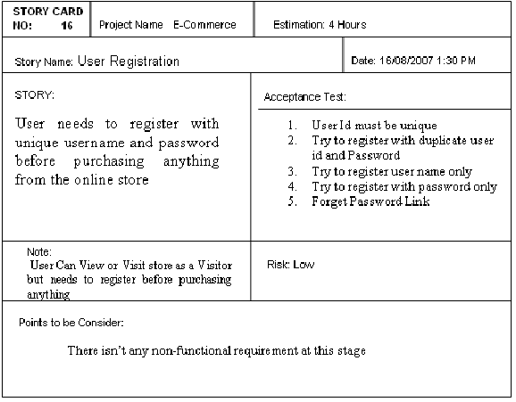

애자일에서의 요구사항 사양
=============

애자일 소프트웨어 개발 선언 = 포괄적인 문서보다는 실제로 작동하는 소프트웨어를
얼핏보면 문서를 작성하지 말라는 것 같지만 핵심은 워터폴 모델에서의 문서와는 다른 형태로 작성할 것을 권장하는것!

요구사항은 필수항목이지만, 스토리는 더 좋은 제품을 만들기위한것 -> 수익에 변경사항이 있다면 그쪽으로 정책을 이동함

좋은 스토리란?
- 스토리는 고객과 개발팀이 작성하며 양측이 이해할 수 있어야함
- 짧고 간략한 목적, 상세한 사양이 아닌 대화를 나누기 위함임
- 각 스토리는 사용자가 무언가 가치를 전달할 수 있어야한다.

**스토리로 작성한다는건**  

(출저 : https://www.researchgate.net/figure/Story-cards-captured-through-the-new-improved-requirement-elicitation-process-based-on_fig1_228748903)

여기서 비기능 요구사항등은 짧은 시간동안 팝업창이 나타난다 -> 유도리있게 개발자가 알아서 설정하고 고객이 프로토타입에서 컨펌을 하는것이 애자일.

PS) 라인에서 스토리를 어떻게 적용하는지? : https://engineering.linecorp.com/ko/blog/user-story-point-in-line-pay-team

사용자 스토리 정의
- 독립적
- 협상할 수 있다(요구사항 사양과는 다르다. 요구사항은 고객과 협상하지 않음)
- 가치가 있음
- 추정할 수 있음
- 작다
- 테스트할 수 있음

### 사용자 스토리의 장점

애자일 품질에서 중요한 것은 개발자가 이터레이션 안에서 구현하는 완전한 사용자 스토리 작성 -> 테스트 담당자가 이터레이션 기간에 체크하는 것

